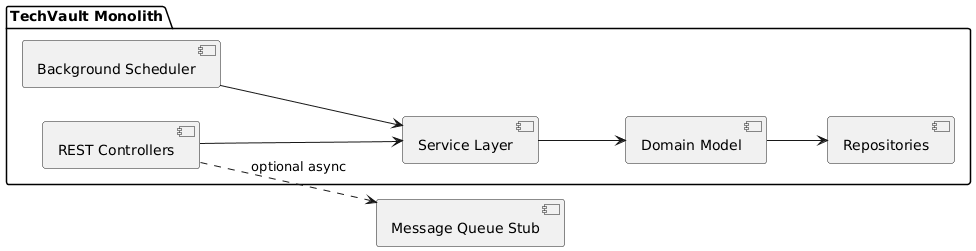
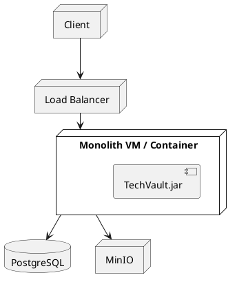
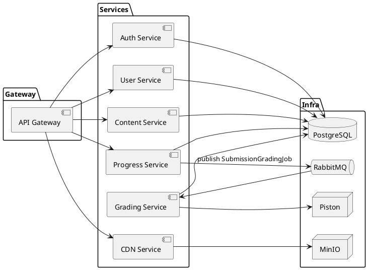
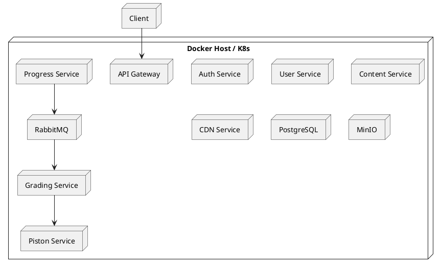
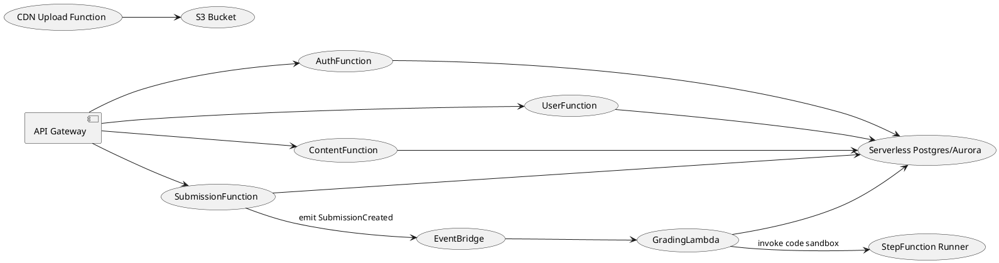
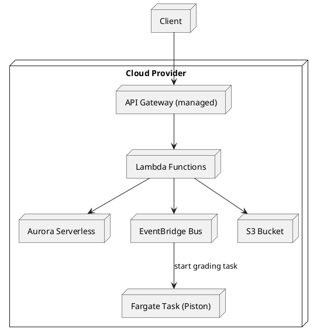

# Milestone 3 – Architecture Investigation & Evaluation

This milestone compares three architectural styles for TechVault. Each section describes how the system would look, shows component/deployment diagrams (PlantUML), and analyzes pros/cons relative to our requirements.

---

## 1. Monolithic Architecture

### 1.1 Description
All features (auth, users, content, progress, grading, CDN) live inside one Spring Boot application. Controllers share a single codebase, domain layer, and data access layer. A single PostgreSQL database holds every table. Background grading runs via internal threads or Quartz jobs rather than a detached service.

### 1.2 Component Diagram

### 1.3 Deployment Diagram

### 1.4 Pros
- Simplest deployment (one artifact, one pipeline).
- No network hops between modules; easiest to debug locally.
- Consistent transactions across all modules (single DB transaction).

### 1.5 Cons
- Scaling is coarse: need to scale the whole app even if only grading is busy.
- Long build/test cycles; teams step on each other’s changes.
- Fault isolation is poor: a bug in grading can crash the entire platform.
- Harder to adopt new tech (e.g., Node-based Piston or future ML models) because the runtime is locked to Java.

---

## 2. Microservices Architecture (current choice)

### 2.1 Description
Independent Spring Boot services per bounded context: Auth, User, Content, Progress, Grading, CDN, plus infrastructure services (RabbitMQ, MinIO, Piston). Each service owns its REST API, repositories, and Docker image. The API Gateway centralizes routing/security. RabbitMQ decouples submissions from grading workloads.

### 2.2 Component Diagram

### 2.3 Deployment Diagram

### 2.4 Pros
- Services scale independently (e.g., run multiple grading containers).
- Fault isolation: grading crash doesn’t kill auth.
- Technology freedom (Node for Piston, potential Go service later).
- Smaller, focused codebases; easier CI.
- Matches our domain boundaries (auth, content, progress, etc.).

### 2.5 Cons
- Operational overhead (service discovery, tracing, shared observability).
- Requires messaging infrastructure and disciplined interface contracts.
- Cross-service transactions require sagas/compensation.

---

## 3. Event-Driven Serverless Architecture (alternative distributed style)

### 3.1 Description
Instead of long-running services, core features become managed functions (AWS Lambda-style). API Gateway still fronts the system, but each endpoint triggers a function. State lives in managed databases/storage. Code submissions drop into an event bus (e.g., AWS EventBridge), and managed workers run grading jobs. CDN uploads go directly to S3 via signed URLs.

### 3.2 Component Diagram

### 3.3 Deployment Diagram

### 3.4 Pros
- Virtually zero ops: auto-scaling, pay-per-use, built-in monitoring.
- Natural fit for bursty workloads (grading spikes, guardianship emails).
- Event-driven backbone simplifies fan-out (notifications, analytics, ML later).

### 3.5 Cons
- Cold starts impact latency (problematic for synchronous endpoints).
- Harder local development (need emulators/mocks).
- Vendor lock-in; migrating away from a cloud provider becomes costly.
- Long-running grading jobs may exceed Lambda time limits (require separate containers anyway).

---

## 4. Comparison & Final Choice

| Style | Fit for TechVault | Key Pain |
| --- | --- | --- |
| Monolith | Easy start, but fails to isolate grading/CDN workloads; deployment risk. | Scaling + team autonomy. |
| Microservices | Aligns with domain boundaries, isolates heavy workloads, supports real DevOps practices. | Requires infra automation and good observability. |
| Event-driven Serverless | Great elasticity and decoupling. | High vendor lock-in and local dev complexity; grading runtimes need special handling. |

**Decision:** We continue with the **microservices architecture**. It balances autonomy, technology choice, and operational complexity. Monolith would constrain scaling and testing; serverless would explode cost/lock-in and complicate our custom Piston runner. Microservices keep each context clean, let us reuse commodity infrastructure (Docker, RabbitMQ, MinIO), and are realistic for both production and teaching environments. With clear contracts and the docs above, we can onboard new contributors quickly while still evolving features independently.
